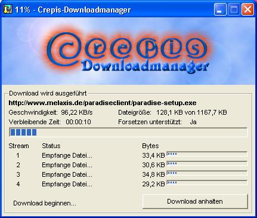



## Crepis \- 4\-STREAM\-DOWNLOADMANAGER

### Description

this is a simple download-manager which demonstrates how to download a file with 4 streams. the file will be divied into 4 parts and they will be downloaded at the same time. this is just a very simple application, if the server does not support resume it crashes :) but you can also learn how to get the remaining time and the transfer rate... btw it's german :)
 
### More Info
 
well... the url, the path for the destination-file, a user-agent (browser) and a cookie :-)

this code uses my melpro.bas, a module with many functions and subs. only a few are really used in crepis ;) if you need a little translation..:

Neuer Download-Auftrag = New Download-Task

Speichern nach = Save to

Erweiterte Header-Optionen = Advanced Header-Options

Download starten = Start Download

Download wird ausgeführt = downloading...

Geschwindigkeit = Speed/Transferrate

Dateigröße = Filesize

von = of

Verbleibende Zeit = Remaining time

Fortsetzen unterstützt = Resume support

Empfange datei... = Receiving file

Download anhalten = Pause/Stop download

the file? :)

this is not a finished downloadmanager, if a server does not support resume it won't work :)

             |
---                |---
**Submitted On**   |2001-06-16 14:08:14
**By**             |[Pablo Hoch](https://github.com/Planet-Source-Code/PSCIndex/blob/master/ByAuthor/pablo-hoch.md)
**Level**          |Intermediate
**User Rating**    |5.0 (55 globes from 11 users)
**Compatibility**  |VB 6\.0
**Category**       |[Internet/ HTML](https://github.com/Planet-Source-Code/PSCIndex/blob/master/ByCategory/internet-html__1-34.md)
**World**          |[Visual Basic](https://github.com/Planet-Source-Code/PSCIndex/blob/master/ByWorld/visual-basic.md)
**Archive File**   |[Crepis \- 4280811092001\.zip](https://github.com/Planet-Source-Code/pablo-hoch-crepis-4-stream-downloadmanager__1-27934/archive/master.zip)

